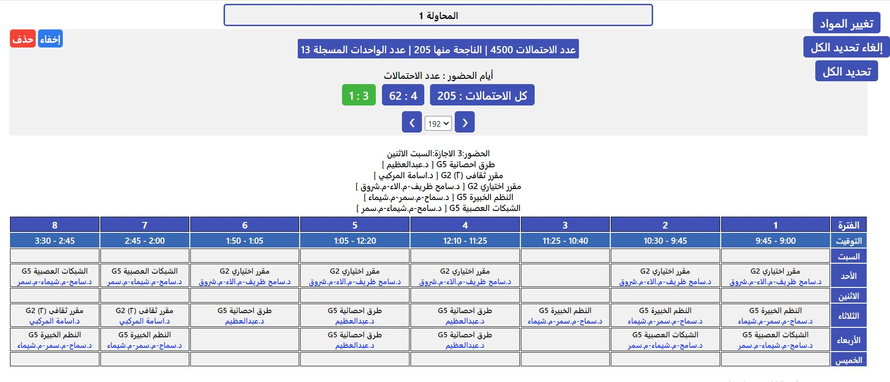

# أداة توليد الجداول الدراسية 

هذه الأداة تمكن الطالب من توليد كل احتمالات النجاح في تسجيل ما يختاره من مواد حسب ما يفضله من محاضرين ومعيدين.

وبعد توليد الاحتمالات، بإمكان الطالب معاينتها في صورة جدول دراسي وفلترتها حسب أيام الحضور سعيا لإيجاد الجدول المناسب لحياته الشخصية والجامعية.


## المشاكل التي يعانيها الطلاب.
### عمل الجداول يدويا يبعث الضجر ويستنفد الجهد والوقت.
يحتاج الطالب كل فصل دراسي إلى عمل جدول مناسب له حسب ما يفضله من محاضرين ومعيدين 
وليس أمامه إلا أن يقوم بذلك يدويا مما يستنفد جهدا ووقتا كبيرين وسيخلص كل ذلك العناء إلى جدول واحد فقط على الأغلب. 


### جدول القسم عرضة للتغير.
قد يقوم القسم بتغيير مواعيد المواد والقائمين بتدريسها، وقد يقع ما ليس في الحسبان.


### اكتمال سعة المجموعات أثناء فترة التسجيل الفعلية.
تسع كل مجموعة من مجموعات المواد عددا محددا من الطلاب، وإن بلغت مجموعة سعتها وكانت ضمن ما اختراه الطالب في جدوله، 
فسيضطر إلى تعديل الجدول يدويا وهو مقيد بفترة التسجيل المحدودة.

## المميزات
- اختبار تشكيلات مختلفة من المواد والمجموعات في نفس الوقت.
- معاينة الاحتمالات الناجحة في صورة جدول دراسي والتنقل بينهم.
- فلترة الاحتمالات الناجحة حسب عدد أيام الحضور.


## تشغيل الأداة
أولا تأكد من تثبيت  [Node.js](https://nodejs.org/en/download)
  
ثم قم بتحميل المشروع أو نسخه

```bash
  git clone https://github.com/AlMoaanediLabs/ClassScheduleGenerator
```

توجه لمكان المشروع

```bash
  cd my-project
```

قم بتثبيت لوازم المشروع

```bash
  npm install 
```
لبناء المشروع

```bash
  npm run build 
```


## صور

